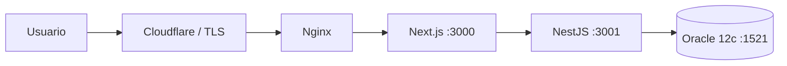

# Dashboard EMETRA: PHP → Next.js + NestJS + Oracle 12c

Migración funcional de `dashboard_general_2026.php`. Se conservan los filtros, nueve rubros de remisiones y cepos, comparativo mensual/período, detalle diario, barras, cámaras, efectividad y descarga Excel `.xlsx`. Los SQL están en `backend/src/infra/queries.ts`; revíselos con el DBA antes de producción. La aplicación usa las tablas existentes: no crea ni modifica tablas Oracle.

## Flujo

En local, `http://localhost:8080` llega a Nginx en el contenedor. Nginx envía al frontend. Next renderiza el panel y envía una consulta GraphQL a Nest en `http://backend:3001/graphql`; Nest ejecuta SQL con parámetros *bind* en Oracle. El navegador solo conoce la ruta de Nginx. Para Excel, el navegador llama a `/api/export` de Next, que transmite el `.xlsx` generado por Nest. `localhost` se utiliza únicamente desde el equipo que abre el navegador; entre contenedores se usan los nombres `backend` y `frontend`.

## Iniciar en Docker Desktop

1. Crear `.env` a partir de `.env.example`; asignar usuario Oracle con permiso SELECT, contraseña y cadena de conexión. No incluir credenciales en Git.
2. Desde la carpeta del proyecto ejecutar `docker compose up --build -d` y luego `docker compose logs -f backend`.
3. Abrir `http://localhost:8080`. El equipo con Docker debe resolver `MUNISCAN.MUNI` y alcanzar el puerto 1521 mediante red institucional o VPN. Si Docker no resuelve ese nombre, configurar DNS institucional en Docker Desktop o usar un descriptor TNS/IP autorizado en `ORACLE_CONNECT_STRING`.
4. Detener: `docker compose down`. Para volver al día siguiente: iniciar Docker Desktop y ejecutar `docker compose up -d`. Para actualizar código: `git pull` y `docker compose up --build -d`.

No hay volumen para el código: va incluido en las imágenes. `.env` configura el backend al iniciar, sin reconstrucción. El puerto 8080 está ligado a `127.0.0.1`, por lo que solo responde en el servidor local. Si se instala detrás de un Nginx institucional ya existente, ese Nginx puede apuntar a `127.0.0.1:8080`.

## Reglas y ejemplo

- Fechas `DD-MM-YYYY`. Ejemplo: `inicio=01-09-2026`, `fin=24-09-2026`.
- Si inicio y fin caen en el mismo mes, comparativo = mes completo. Si abarcan meses, comparativo = rango seleccionado (idéntico al PHP).
- La cantidad pagada sigue la **fecha del documento de pago**, aunque la imposición corresponda a otra fecha. Se preserva el significado original.
- Cepos = Q500 por registro; pago si `ESTATUS='P'`.
- Efectividad = impuestas / captadas × 100.
- Detalle: `GET /api/detalle?inicio=01-09-2026&fin=24-09-2026&rubro=Cepos` (solo accesible desde la red de contenedores, salvo que se publique deliberadamente).
- GraphQL: `query { dashboard(inicio:"01-09-2026", fin:"24-09-2026") { totalRango { total monto } } }`.

## Arquitectura del código

- `backend/src/domain`: contratos y tipos de los datos.
- `backend/src/application`: validación y caso de uso.
- `backend/src/infra`: adaptador Oracle y SQL.
- `backend/src/http`: entradas REST y GraphQL.
- `frontend/components/atoms/Metric.tsx`: número con etiqueta.
- `frontend/components/molecules/RubroCard.tsx`: dos columnas de métricas.
- `frontend/components/organisms/Filters.tsx`: formulario de fechas/cámara.
- `frontend/app/page.tsx`: compone el panel con esos componentes.
- `frontend/app/api/export/route.ts`: ruta de descarga interna.

## Producción y CI/CD

1. Crear repositorio **privado** de GitHub tras verificar que no incluye `.env` ni el PHP original con su contraseña. `git init`, `git add .`, `git commit -m "Migrar dashboard"`; conectar el remoto asignado por EMETRA y `git push`.
2. GitHub Actions compila Next y Nest y revisa TypeScript sin abrir una conexión a Oracle. El despliegue manual (`workflow_dispatch`) usa un runner `self-hosted, linux, emetra` instalado en el **mismo servidor** donde se ejecuta Docker; requiere `/etc/emetra/dashboard.env` legible por el runner, Docker Compose y acceso al repositorio. El entorno `production` de GitHub debe exigir aprobación institucional. No se incluyen claves de despliegue en el proyecto.
3. Nginx institucional termina TLS o recibe tráfico HTTPS solo del túnel de Cloudflare. Establecer DNS/Proxy Cloudflare hacia ese Nginx, TLS válido y reglas de acceso institucional; **no** exponer `:3000`, `:3001`, `:1521`, `/graphql` o `/api/exportar` al exterior. Proteger el dashboard con SSO/Cloudflare Access o mecanismo institucional antes de publicarlo.
4. Rotar la contraseña presente en el PHP de origen, crear cuenta Oracle de solo lectura, limitar acceso a Oracle por firewall y respaldar `.env` en gestor de secretos institucional.
5. Probar, para fechas y cámara iguales, las diez filas, totales, detalle diario y Excel del PHP contra los resultados nuevos. La unión de cámaras asocia remisiones al mismo día y vehículo, tal como lo hacía el PHP: no demuestra que *esa captura específica* originara la remisión.

### Nota Oracle

`oracledb` usa modo Thin por defecto y admite Oracle 12.1 o posterior. Si la cuenta usa un verificador de contraseña antiguo y aparece `NJS-116`, solicitar al DBA un verificador compatible o configurar modo Thick con Oracle Instant Client en un entorno controlado. Verificar versión exacta 12c y requisitos TLS/servicio con el DBA. El pool tiene máximo 4 conexiones para evitar agotar `SESSIONS_PER_USER`.

### Pruebas pendientes en la red de EMETRA

Esta entrega se puede compilar sin base institucional, pero la equivalencia numérica debe comprobarse con acceso a MUNI. Las consultas son las del PHP original y algunas agregan múltiples filas por remisión al cruzar detalles; cualquier cambio de criterio debe acordarse con negocio/DBA.
